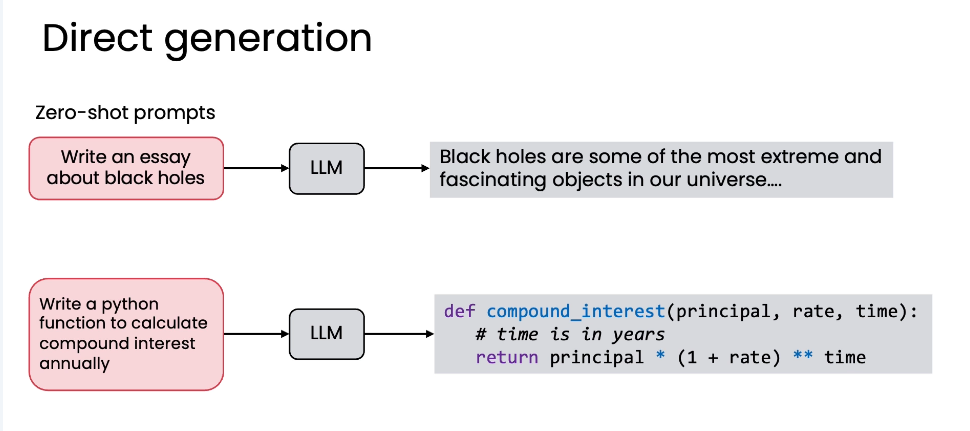
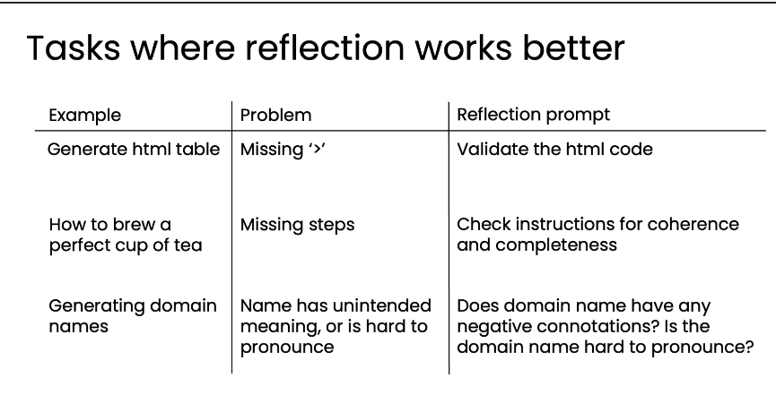

# 为什么不一次直接生成？Why not just direct generation?

在“直接生成”（Direct Generation）与“反思工作流”（Reflection Workflow）之间，我们为何更倾向于要采用一个包含反思步骤的复杂工作流？这个问题直指AI应用的核心权衡：效率 vs. 质量。
虽然“直接生成”看似简单快捷，但“反思”能带来更优的结果，值得我们投入额外的计算成本。

**核心观点： 反思不是为了增加复杂度，而是为了在质量上获得“质的飞跃”。**

## 一、什么是“直接生成”（Direct Generation）？

“直接生成”是AI最基础、最直观的工作方式，也常被称为“零样本提示”（Zero-shot Prompting）。

特点： 简单、快速、一步到位。它不提供任何中间反馈或修正的机会。

术语解释： “零样本提示”中的“零样本”指的是在提示中没有提供任何输入-输出示例。这与“单样本提示”（One-shot）和“少样本提示”（Few-shot）形成对比。 
零样本 (Zero-shot): 写一个关于黑洞的文章(无示例)
单样本 (One-shot): 写一个关于黑洞的文章 + 示例1
少样本 (Few-shot): 写一个关于黑洞的文章 + 多个示例

## 二、反思在性能上全面碾压直接生成
论文《Self-refine: Iterative refinement with self-feedback》的关键图表
- 横轴 (X-axis): 7种不同的任务，包括情感反转、对话响应、代码优化、数学推理等。
- 纵轴 (Y-axis): 性能得分（Performance %）。
- 柱状图配对： 每个任务下有两组柱子：
  - 浅色柱子 (Light bar): 代表“零样本提示”（即直接生成）下的性能。
  - 深色柱子 (Dark bar): 代表“相同模型+反思过程”下的性能。
在所有7个任务、所有4个被测试的模型（GPT-3.5, ChatGPT, GPT-4, Claude）中，加入反思步骤后的深色柱子，无一例外地高于对应的浅色柱子！

结论：反思模式在各种任务上都能稳定地提升性能。即使是最强大的GPT-4，在加入反思后，其表现也能得到进一步增强。这说明反思是一个普适且有效的优化策略。 

## 三、反思模式更适用的任务场景

反思模式在以下类型的复杂任务中尤其有效：

| 示例 (Example) | 问题 (Problem) | 反思提示 (Reflection prompt) |
| :--- | :--- | :--- |
| **生成HTML表格** | 格式错误，如缺少 `</tr>` 标签。 | “验证HTML代码。” |
| **泡一杯完美的茶** | 步骤缺失或顺序错误。 | “检查说明的连贯性和完整性。” |
| **生成域名** | 名称可能有负面含义或难以发音。 | “域名是否有负面含义？是否难发音？” |

## 四、如何编写高效的反思提示语
编写反思提示的两大黄金法则：
1. 明确指示反思动作 (Clearly indicate the reflection action):
  - 不要含糊地说“请改进”，而要说“请审查”、“请检查”、“请验证”。
  - 明确告诉模型你要它做什么，例如“审核电子邮件初稿”或“验证HTML代码”。
2. 具体指定检查标准 (Specify criteria to check):
  - 不要只说“让它更好”，而要列出具体的评判标准。
  - 例如，在域名任务中，标准是“易发音”和“无负面含义”；在邮件任务中，标准是“语气专业”和“事实准确”。
  - 这样做能引导模型围绕你最关心的维度进行深入思考和改进。

