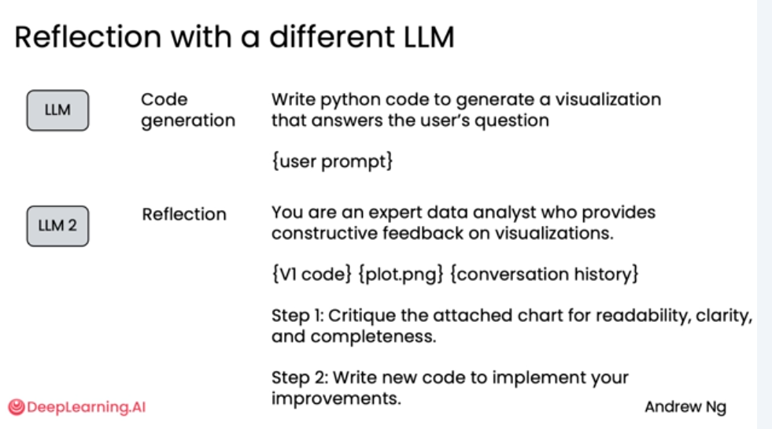

# 图表生成工作流程 Chart generation workflow
如何利用“反思设计模式”结合多模态AI，将一份粗糙的图表初稿，迭代优化为清晰、美观、专业的可视化作品。
通过一个咖啡销售数据的实战案例，生动展示了AI如何像人类专家一样“审视”和“改进”自己的工作成果。

### 直接生成
1. 向 LLM 发送提示：“Create a plot comparing Q1 coffee sales in 2024 and 2025 using coffee_sales.csv.”
2. LLM 生成第一版 Python 代码（V1 code），用于读取CSV文件并绘制图表。
3. 执行与结果：运行 V1 代码，生成了一张名为 plot.png 的图表。
4. 问题显现： 这是一张堆叠柱状图（Stacked Bar Plot）。虽然它完成了数据展示的基本功能，但存在两大缺陷：
  - 堆叠柱状图对于比较不同年份同一饮品的销量不够直观。
  - 图表整体观感不佳，缺乏专业性。

### 引入反思 —— 多模态模型的视觉推理
将生成的图像作为输入，交由一个多模态语言模型（Multi-modal LLM）进行反思。
1. 输入准备： 将 V1 版本的代码 (V1 code) 和它生成的图表 (plot.png) 一同打包，作为新的输入。
2. 反思指令： 提示多模态 LLM 扮演“专家数据分析师”的角色，对图表进行批判性评估。
3. 视觉推理： 多模态模型能够“真正地看”这张图，分析其可读性、清晰度和完整性，并提出具体的改进建议。
4. 生成新代码： 根据反思反馈，模型更新代码，生成第二版（V2 code）。
5. 最终成果： 运行 V2 代码，生成了 plot_v2.png。

### 使用不同的模型进行分工协作
- LLM (初始生成)： 负责根据用户提示生成第一版代码。例如，可以使用 GPT-4 或 GPT-5 等强大的通用模型。
- LLM 2 (反思阶段)： 负责接收第一版代码、生成的图表以及对话历史，扮演“专家分析师”的角色，提供建设性反馈并指导代码改进。这个角色可能更适合由具备强大推理能力的“思考模型”（Reasoning Model）来担任。

### 反思提示语示例：

您是一位专业的数据分析师，能够为可视化提供建设性反馈。
{V1 代码} {plot.png} {对话历史记录}
步骤 1：评估所附图表的可读性、清晰度和完整性。
步骤 2：编写新代码来实现您的改进。

## 总结：
- 反思机制并非万能，其效果因应用场景而异。在某些任务上提升显著，在另一些任务上则可能微乎其微。
- 因此，了解反思机制对你特定应用的影响至关重要。它能为你提供优化方向，无论是调整初始生成提示，还是优化反思提示，都能帮助你获得更好的性能。